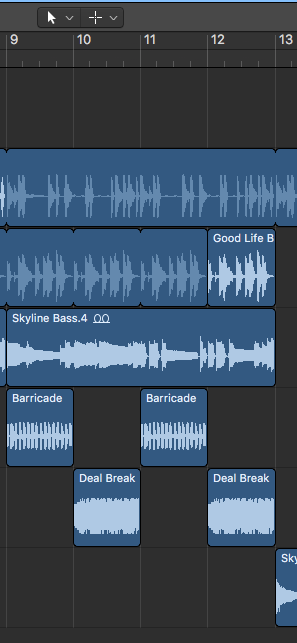

# Welcome to Aaron's Music B30 Project
##### Get Dancing Mix

The first lesson requires a one minute hip-hop instrumental and you do that by using loops in the loop browser, it was sort of hard to get used to logic at first but i'm getting the hang of it slowly. So in total 6 different loops were used for making this project which is not my usual go-to because when i usually make music on ableton i just use vst's, i rarely use melody samples except for single drum samples that i can program into a drum rudiment.

After all the first 4 loops were put in the places that they are in, at the 9th bar i put two different loops, one called "Barricade Arpeggio" and the other being "Deal Breaker Arpeggio", both of these switch off every bar which makes the song not feel as bland.

They were also panned from left ear to right ear at about -35 and +35 just to make the listening experience more fun.

A space designer plug-in was added to the bridge piano which is called "Skyline Piano", which gives the sample a little more reverb and makes it sound more atmospheric.

Then finally a "Bass Amp Designer" plug-in was added to the "Skyline Bass" sample which gave the bass a louder sound and a little bit of distortion might have been added from what it seems. That basically sums up this whole project, the file should be on this page somewhere to be used for listening purposes. One tip i do have for the class would be to always save your project because you never know when your pc might shut down or logic might crash, and if that wasn't relevant I also think loops shouldn't be used as much because it's not really that creative but then again maybe its just for this lesson. 

<audio src="Get Dancing Mix.mp3" controls preload></audio>

### Markdown
- [x] Create and upload five (5) screenshots.
- [x] Bounce Logic project and upload to audio folder.
- [x] Write at least 250 words on your experience with the lesson.
- [x] Audio plays back through external speakers.
- [x] Screenshots render correctly.
- [x] Text is legible.
- [x] Demonstrate one tip for class.

